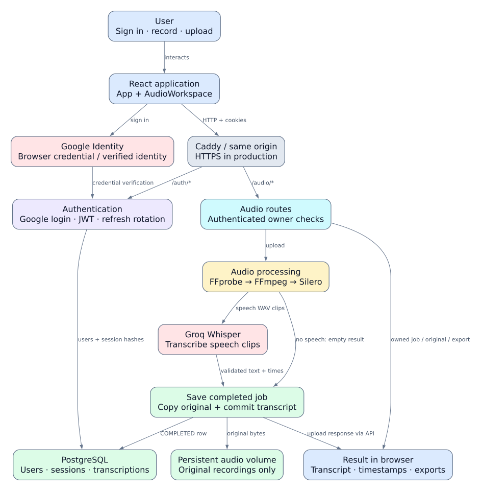

# Transcription AI architecture atlas

This is a map of the implementation in this repository, including its current
limitations. It covers browser behavior, authentication, audio processing,
persistence, exports, data contracts, startup, migrations, and deployment.

## Open the visuals

- **[Interactive offline atlas](index.html)** — eight diagrams and a searchable
  function reference. Open this file in a browser; it needs no server or CDN.
- **[Editable Excalidraw board](app-flow.excalidraw)** — eight flow sections followed
  by an atlas of every named function, grouped by source file. Open Excalidraw,
  choose **Open**, and select this file. All shapes, arrows, and text are editable.
- **[Whole-app SVG](app-flow.svg)** / **[PNG](app-flow.png)** — overview for sharing.
- **[Mermaid diagrams](diagrams.md)** — all flow diagrams embedded in Markdown.
- **[Function-by-function reference](function-reference.md)** — all 85 named
  functions, with signatures, source links, behavior, and syntactic call lists.
- **[Function map Mermaid source](function-map.mmd)** — exhaustive module/function
  index. This is a containment map, not a call graph.



## Diagram files

| View | Mermaid | Visual |
| --- | --- | --- |
| Entire app | [app-flow.mmd](app-flow.mmd) | [SVG](app-flow.svg) |
| Login and access checks | [auth-login.mmd](auth-login.mmd) | [SVG](auth-login.svg) |
| Session refresh and logout | [session-refresh.mmd](session-refresh.mmd) | [SVG](session-refresh.svg) |
| Recording and UI | [recording-ui.mmd](recording-ui.mmd) | [SVG](recording-ui.svg) |
| Audio processing | [audio-pipeline.mmd](audio-pipeline.mmd) | [SVG](audio-pipeline.svg) |
| Storage and exports | [storage-export.mmd](storage-export.mmd) | [SVG](storage-export.svg) |
| Startup and deployment | [deployment.mmd](deployment.mmd) | [SVG](deployment.svg) |
| Data model | [data-model.mmd](data-model.mmd) | [SVG](data-model.svg) |

Blue nodes represent the browser; purple authentication; cyan API contracts and
routes; amber audio/text processing; green persistent data; pink external services;
gray infrastructure; red errors or implementation caveats. Arrow labels state
whether an edge is a call, response, dependency, or data relationship.

## Walk through one recording

1. `main.tsx` mounts `App` inside React StrictMode. The App effect calls `loadUser`.
   If no session can be recovered, `Login` renders `GoogleLoginButton`.
2. Google returns an identity credential. `handleCredentialResponse` sends it to
   `/auth/google`; the backend verifies it, finds or creates a user, persists a
   refresh-token hash, commits, and sets HttpOnly cookies. App loads the user again.
3. `AudioWorkspace` loads limits and renders `AudioRecorder`. `start()` requests
   the microphone, chooses a supported media format, and starts collecting chunks.
4. `stop()` stops capture. Final media events build a `File` and a preview URL;
   `onReady(file)` selects it in the workspace. This has not sent audio anywhere.
5. `handleUpload()` checks the file, calls `runAction()`, then `uploadAudio()` creates
   multipart form data. `authenticatedFetch()` includes cookies and can recover
   an expired session before retrying once.
6. FastAPI validates the authenticated user and request. `receive_upload()` counts
   bytes while copying into a temporary file. `probe_audio()` reads FFprobe metadata;
   browser WebM recordings without duration use packet timestamps instead.
7. FFmpeg produces mono 16 kHz PCM WAV. The backend probes and checks its duration
   again, then Silero finds speech ranges. A lock protects the cached stateful ONNX
   model. The ranges are copied into temporary WAV clips.
8. `transcribe_clips()` sends each clip sequentially to Groq Whisper, validates its
   result, clamps segment ends to the clip duration, and adds the clip's original
   start offset. Text and unique detected languages are combined. Zero clips skip
   Groq and produce a successful empty transcript.
9. `AudioStorageService.save()` copies the original to a generated path, stages a
   `COMPLETED` transcription, and commits. On ordinary persistence failure it rolls
   back and removes the copied original. Temporary processing files are deleted.
10. The frontend maps `SavedAudio` into `SavedJob`, shows the transcript and ID, and
    supports owned-job retrieval, original downloads, and TXT/SRT/VTT exports.

## React callbacks and lifecycle behavior

Named functions are indexed in the function reference. The following anonymous
callbacks are also part of runtime behavior:

| Location / callback | What it does |
| --- | --- |
| `App` mount effect and cleanup | Starts `loadUser`; uses an active flag so late success/failure cannot update an unmounted component. Ends loading after the request. |
| `App` session-expired callback | Clears the user and shows the sign-in screen with an expiry message. |
| `GoogleLoginButton` callback-ref effect | Keeps `onLoginRef.current` synchronized with the latest prop. |
| `GoogleLoginButton` initialization effect | Registers Google callback and renders the button if the SDK and DOM ref exist. |
| `AudioWorkspace` limits effect | Retrieves size/duration limits; ignores a late response after unmount and tolerates fetch failure. Backend enforcement remains active. |
| Recorder `onBusyChange` prop | Updates workspace recording state and App audioBusy state so incompatible controls are disabled. |
| File picker `onChange` | Selects a File or clears it when the picker returns no file. |
| Language/job-ID `onChange` | Updates form state; language is lowercased and constrained by the HTML form. |
| `AudioRecorder` mount effect cleanup | Marks unmounted, clears duration timeout, stops recorder and microphone tracks. |
| Preview effect cleanup | Revokes an obsolete object URL when the preview changes or unmounts. |
| `recording.ondataavailable` | Counts bytes, collects nonempty chunks, or marks oversize failure and stops capture. |
| `recording.onerror` | Marks the recording failed, shows feedback, and calls `stop()`. |
| `recording.onstop` | Clears timeout, releases tracks, skips failed/unmounted captures, makes Blob/File/URL, and calls `onReady`. |
| `setTimeout(stop, duration)` | Ends capture at the advertised maximum duration. |
| Download timeout | Revokes the temporary download object URL after one second. |
| Auth promise `finally` handlers | Clear module-level shared request promises after completion or failure. |
| Render `.map()` callbacks | Build decorative login cards/waveform bars, export buttons, or timestamp list items; they do not make transcription requests. |

## HTTP surface and recovery

| Method and path | Route → primary service | Access and result |
| --- | --- | --- |
| `GET /health` | `health()` | Public process-health response; does not test DB or Groq. |
| `POST /auth/google` | `google_login()` → `login_with_google()` | Google credential → user/session cookies. |
| `GET /auth/me` | `get_me()` + `get_current_user` dependency | Access cookie → public profile. |
| `POST /auth/refresh` | `refresh()` → `refresh_tokens()` | Refresh cookie → atomic rotation and replacement cookies. |
| `POST /auth/logout` | `logout()` → `AuthService.logout()` | Revoke supplied refresh session and clear cookies; missing cookie still succeeds. |
| `GET /audio/limits` | `get_audio_limits()` | Public byte/duration limits. |
| `POST /audio/upload` | `receive_audio()` → `receive_upload()` | Authenticated multipart audio → saved completed result. |
| `GET /audio/{job_id}` | `get_saved_audio()` → `get_saved()` | Owned job or 404. |
| `GET /audio/{job_id}/download` | `download_audio()` → `get_download()` | Owned original streamed by FileResponse or 404. |
| `GET /audio/{job_id}/export/{format}` | `export_transcript()` → `render_transcript()` | Owned TXT/SRT/VTT or 404. |

`get_db()` yields a request-scoped SQLAlchemy session and rolls back exceptions.
`get_current_user()` resolves the access cookie through AuthService. It returns
401 for missing/invalid authentication. Repositories filter saved jobs by both
job ID and authenticated user ID.

The frontend's `loadUser()` deduplicates concurrent session checks. A failed
access request can trigger `/auth/me`, refresh, a `/auth/me` retry, and one retry
of the original request. Non-401 errors are not automatically retried by the
frontend. `logout()` waits for in-flight session recovery before revocation.

Refresh rotation conditionally revokes an unexpired row and stages a replacement
in one database transaction. Cookies are set only after commit. Logging out one
session does not revoke other sessions or immediately invalidate already-issued
access JWTs; access JWTs remain valid until their expiry.

### Failure paths

- **400:** unreadable audio, invalid audio metadata, normalization errors, or other
  caught `ValueError` during upload.
- **401:** missing/invalid authentication or failed refresh; UI returns to sign-in.
- **404:** inaccessible job or missing original; ownership is not disclosed.
- **413:** upload size or decoded duration exceeds the configured limits.
- **422:** request schema validation, such as invalid language or UUID.
- **502:** Groq API failure, malformed/empty transcription, or out-of-clip times.
- **503:** missing transcription key or caught runtime error for unavailable tools.
- **500:** `AudioStorageError` during file/database persistence. Unexpected uncaught
  exceptions can also become 500 responses; the route does not normalize every error.

Filesystem copy and database commit are not one atomic operation across process
crashes. The current rollback/remove behavior compensates normal failures.

## Models and contracts

| Type | Responsibility |
| --- | --- |
| `User` | Persistent Google identity; owns refresh sessions and transcriptions. |
| `RefreshSession` | Stores token hash, expiry, revocation time, and user FK; never raw refresh token. |
| `Transcription` | Original storage key, exact byte count, duration, requested/detected language, transcript text, segments JSONB, status and timestamps. |
| `TranscriptionStatus` | Declares UPLOADED/PROCESSING/COMPLETED/FAILED; current upload persistence writes COMPLETED only. |
| `Base` | Shared SQLAlchemy declarative base/metadata. |
| `Settings` | Validated environment and `.env` settings; cached by `get_settings()`. |
| `GoogleLoginRequest` / `AuthResponse` | Google credential input / auth success-message output. |
| `AudioMetadata` | Positive finite duration, sample rate, channels, optional bitrate, codec/container. |
| `SpeechRange` / `SpeechClip` | Detected intervals and temporary clip filenames/offsets/durations. |
| `NormalizedAudio` | Normalized metadata plus ranges, clips, and combined transcription. |
| `ReceivedAudio` / `SavedAudio` | Original metadata plus normalized result; saved variant adds UUID/status. |
| `TranscriptSegment` | Nonempty text and finite ordered times, validated by `check_time_order()`. |
| `ClipTranscription` | Validated nonempty text and segments for a single Groq response. |
| `TranscriptionResult` | Combined text, unique languages, original-timeline segments, processing time. |
| `SavedTranscription` | Public persisted view; computes decimal MB and hides exact internal storage path. |
| Frontend `User` | Account fields consumed by the UI. |
| Frontend `Segment` / `SavedJob` | Result display/download state shared by upload and lookup paths. |
| Frontend `UploadResult` | Nested upload response shape before mapping to SavedJob. |
| `GoogleCredentialResponse` | Credential string delivered by the Google browser SDK. |
| `Props` interfaces | Explicit component callbacks, disabled/busy state, and recorder limits. |
| Error classes | `SessionExpiredError`, `AudioLimitError`, `AudioStorageError`, `TranscriptionUnavailableError`, and `TranscriptionProviderError` select recovery paths; they define no custom methods. |

`AuthService.get_me()` is a defined helper but is not called by the current `/me`
route, which builds the profile dictionary directly. `schemas/user.py` is reserved
and contains no active schema. Celery, Redis, and object-storage packages may be
listed as dependencies, but no worker, Redis service, S3 storage path, or WebSocket
endpoint is wired into this implementation.

## Deployment and scripts

- `compose.yml` runs local Caddy at localhost:8080, PostgreSQL, and the backend.
  Local cookie security permits HTTP on localhost.
- `compose.production.yml` enables secure cookies and Caddy HTTPS. Only web ports
  are published; API and database remain inside the Docker network. It also adds
  persistent certificate/config volumes and log rotation.
- `backend/Dockerfile` installs FFmpeg and the locked Python environment, copies
  application/migration code, and runs as a non-root app user. Compose's startup
  command runs migrations before Uvicorn.
- `frontend/Dockerfile` builds Vite with the Google client ID and same-origin API
  base, then serves the static output from Caddy. The client ID is public configuration;
  server secrets are not frontend build arguments.
- `deploy/init-env.py` reads Google/Groq settings from the local backend environment,
  generates new database/JWT secrets, and exclusively creates a private production
  env file. It refuses to overwrite one; the domain must be filled in later.
- `deploy/package.sh` archives an explicit source-file list, excluding credentials,
  recordings, caches, and installed dependencies.
- `deploy/install-docker-ubuntu.sh` checks root/Ubuntu, uses Docker's apt repository,
  installs Engine and Compose, and enables the daemon; it returns early if both
  are already installed.
- Alembic `run_migrations_offline()` emits SQL; `run_migrations_online()` opens an
  async connection and calls `do_run_migrations()` through `run_sync`. Revision
  `a2549975a23a` creates users/transcriptions; `adea30e5b1a7` creates refresh sessions.
  Their `downgrade()` functions delete those tables/data in reverse order.
- FastAPI `lifespan()` disposes the database engine on shutdown; it does not initialize
  external services at startup.

See [deployment instructions](../../deploy/README.md) for actual server commands.
Default authentication lifetimes are 15 minutes for access and 7 days for refresh.
Default upload limits are 25 decimal MB and 3600 seconds. Production stores originals
at `/data/audio`; non-container default storage resolves to `backend/app/storage/audio`.

## Regenerate and maintain

```bash
# From project root; requires Python 3, Node, Graphviz dot and frontend dependencies
python3 docs/architecture/generate.py
```

The generator reads application source with Python/TypeScript parsers; it does not
import backend settings or read environment secrets. `diagrams.json` defines the
curated flow graphs, and `frontend-explanations.json` explains each named frontend
function. When source behavior changes, update those descriptions and regenerate.
The generator fails if a new named frontend function has no explanation.

SVG/PNG and Excalidraw share Graphviz layout geometry; Mermaid encodes the same graph
with its own renderer's layout. Graphviz DOT sources are included for reproducibility.
Function atlas cards summarize behavior; the linked reference contains full explanations.

Diagram format references: [Mermaid flowcharts](https://mermaid.js.org/syntax/flowchart.html)
and [Excalidraw developer documentation](https://docs.excalidraw.com/).

## Validation performed

- All nine `.mmd` files parsed with Mermaid.
- All 725 native elements restored and serialized using Excalidraw's library.
- Diagram endpoints, element IDs/bindings, and local documentation links checked.
- Excalidraw text widths checked for overflow; overview and audio-pipeline visuals inspected.
- Offline HTML checked for all eight embedded diagrams, all 85 function entries,
  and successful search/filter behavior.

The Excalidraw file was validated programmatically; no project was uploaded to an
external drawing service. Application source and package manifests were not changed.
