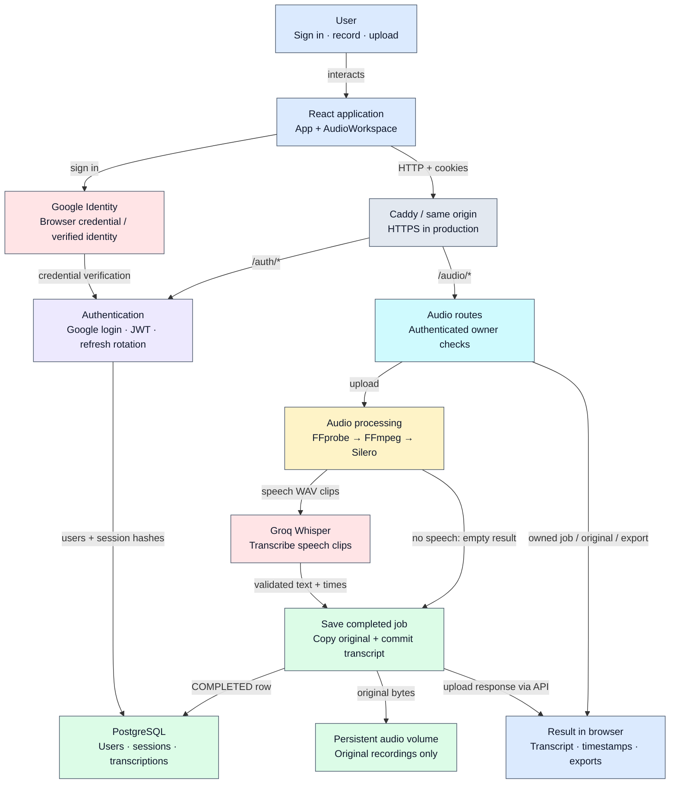
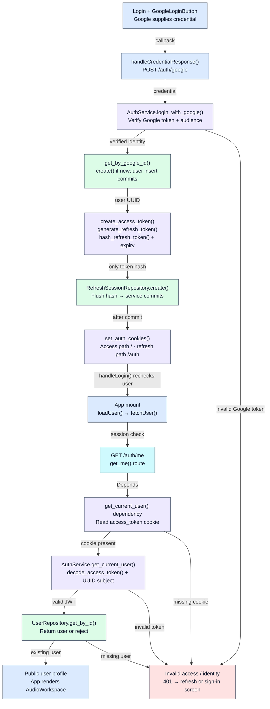
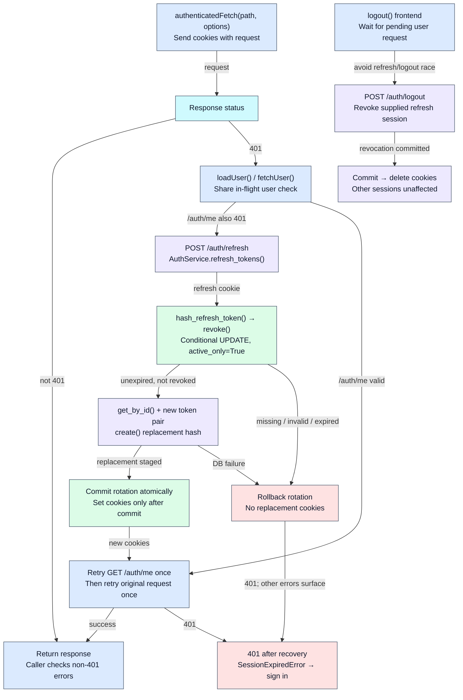
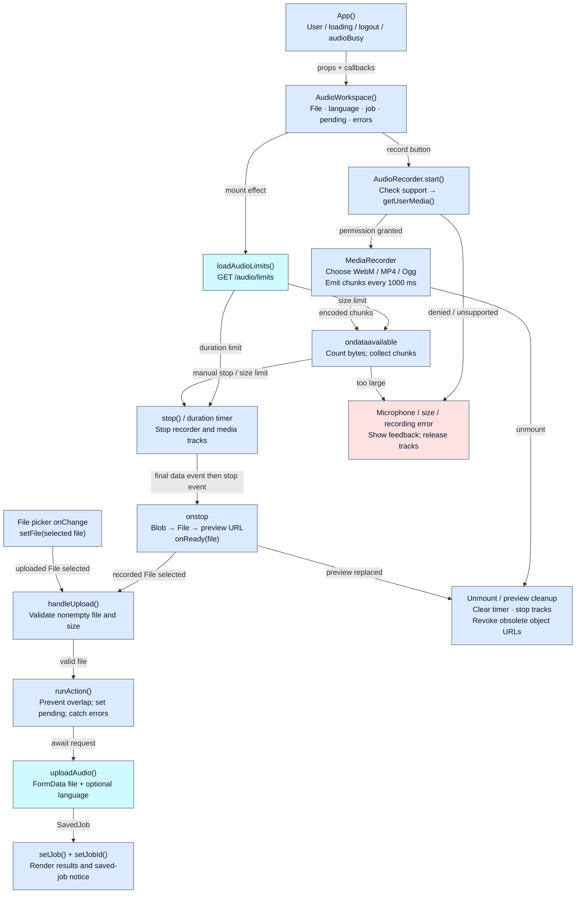
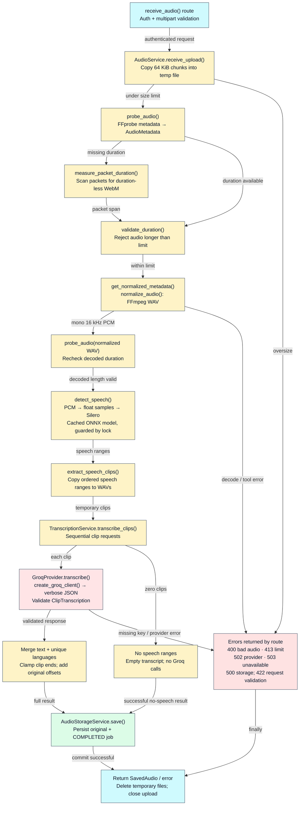
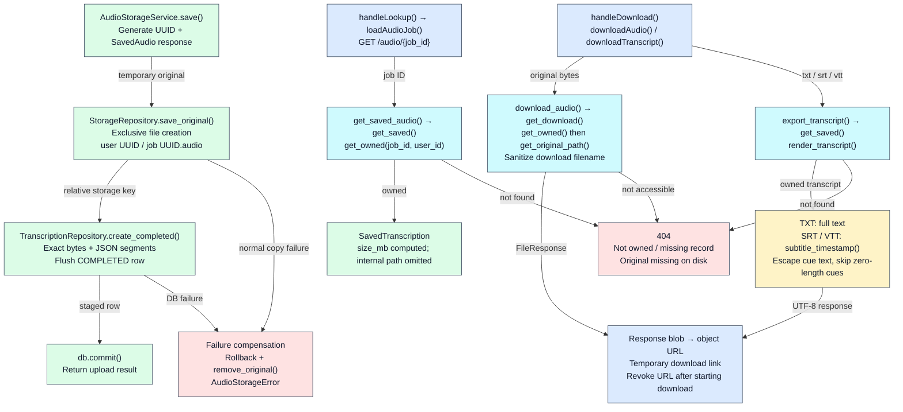
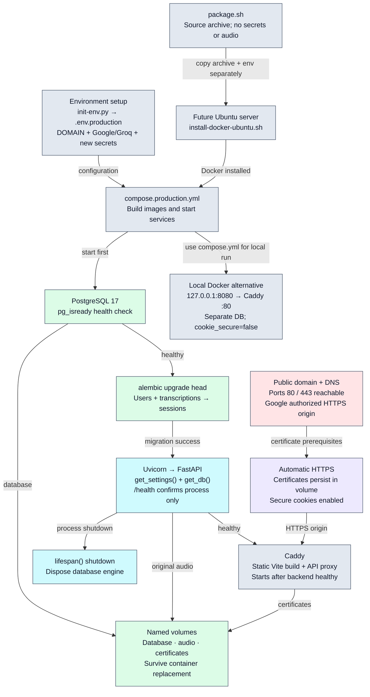
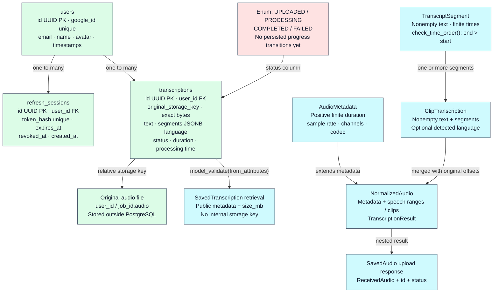

# Application diagrams

Each diagram also has standalone `.mmd`, `.svg`, and `.png` files. Arrows show control or data flow; their labels distinguish the two.

## 01 · Entire app

Read top to bottom: browser actions become authenticated API calls, then stored results.

## 02 · Login and access checks

Session tokens use HttpOnly cookies; only refresh-token hashes are persisted.

## 03 · Refresh, retry, and logout

Concurrent browser checks share one promise; one refresh token can be consumed only once.

## 04 · Browser recording and UI

Recording is local. Stopping creates a File; transcription begins only on Upload and transcribe.

## 05 · Audio processing pipeline

All steps finish inside POST /audio/upload; blocking audio work runs in a thread pool.

## 06 · Persistence, retrieval, and export

The authenticated user ID is included in every saved-job lookup.

## 07 · Startup and production deployment

Production configuration is prepared; this diagram does not imply an AWS deployment exists.

## 08 · Stored data and API shapes

Schema has multiple status values, but the current upload flow persists only COMPLETED jobs.

